# symproof-tree アーキテクチャ設計書

## 目次
1. [システム全体構成](#システム全体構成)
2. [データフロー](#データフロー)
3. [コンポーネント構成](#コンポーネント構成)
4. [ディレクトリ構造](#ディレクトリ構造)
5. [技術スタック](#技術スタック)
6. [データモデル関連図](#データモデル関連図)

---

## システム全体構成

### 高レベルアーキテクチャ

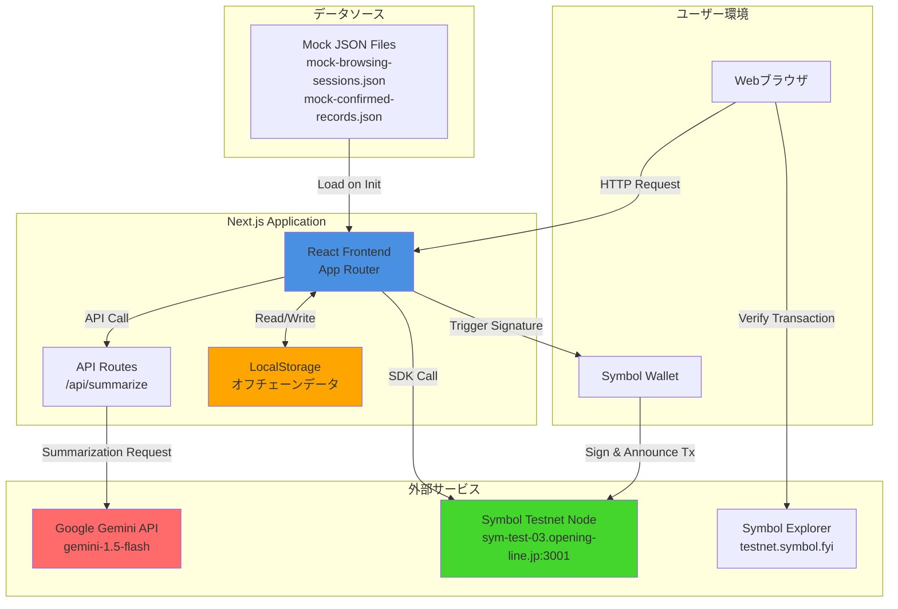

### レイヤー構成

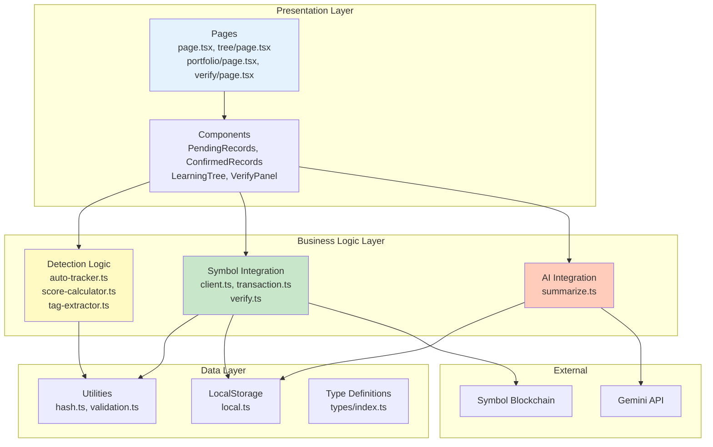

---

## データフロー

### 1. 自動検出から確認までのフロー

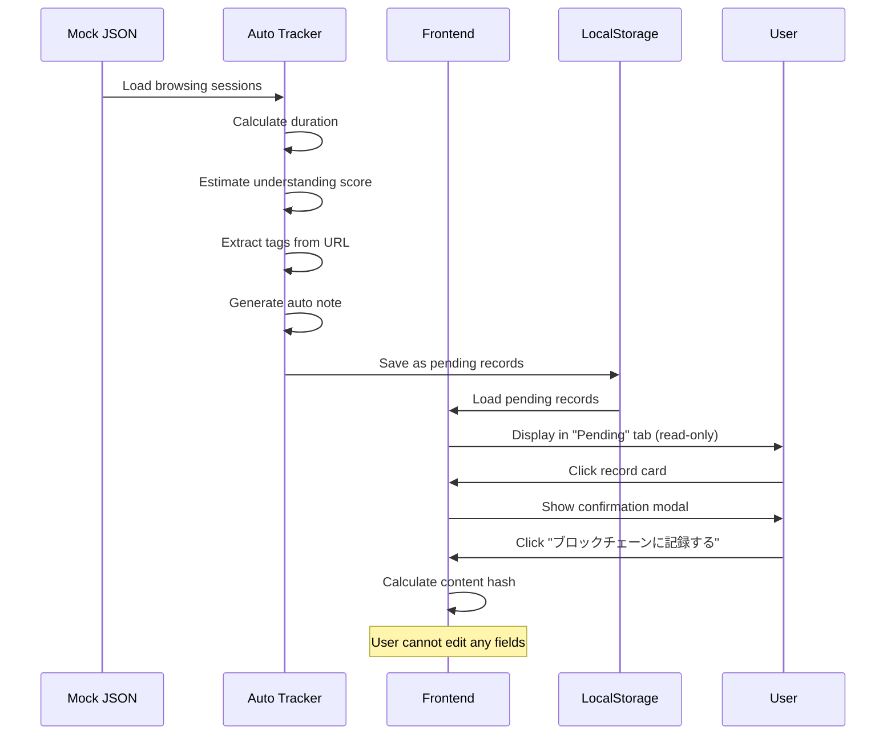

### 2. ブロックチェーン記録フロー

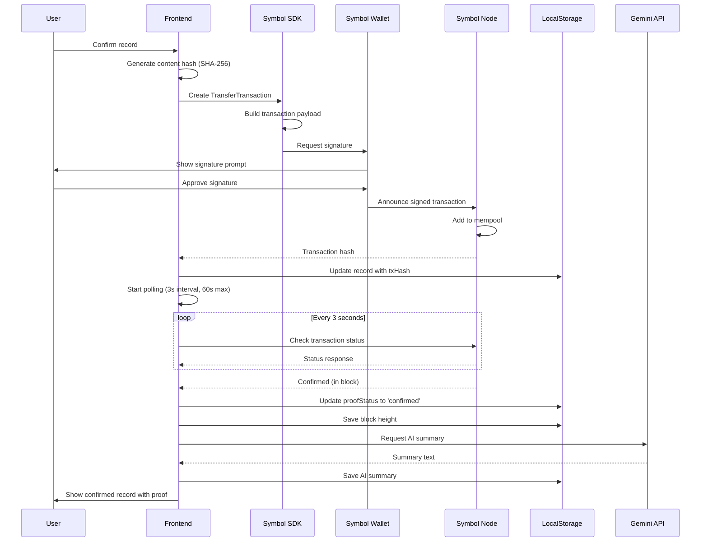

### 3. 検証フロー

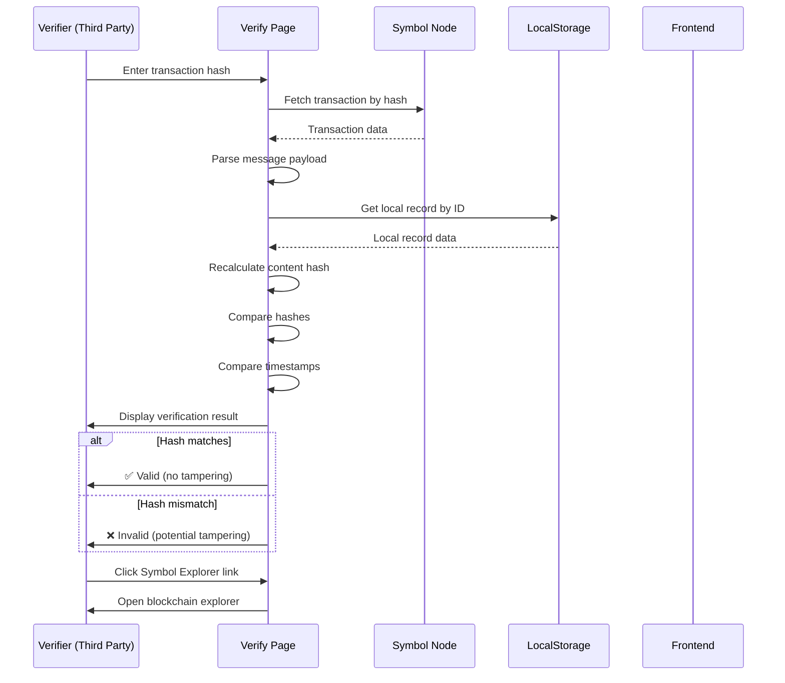

### 4. AI要約生成フロー

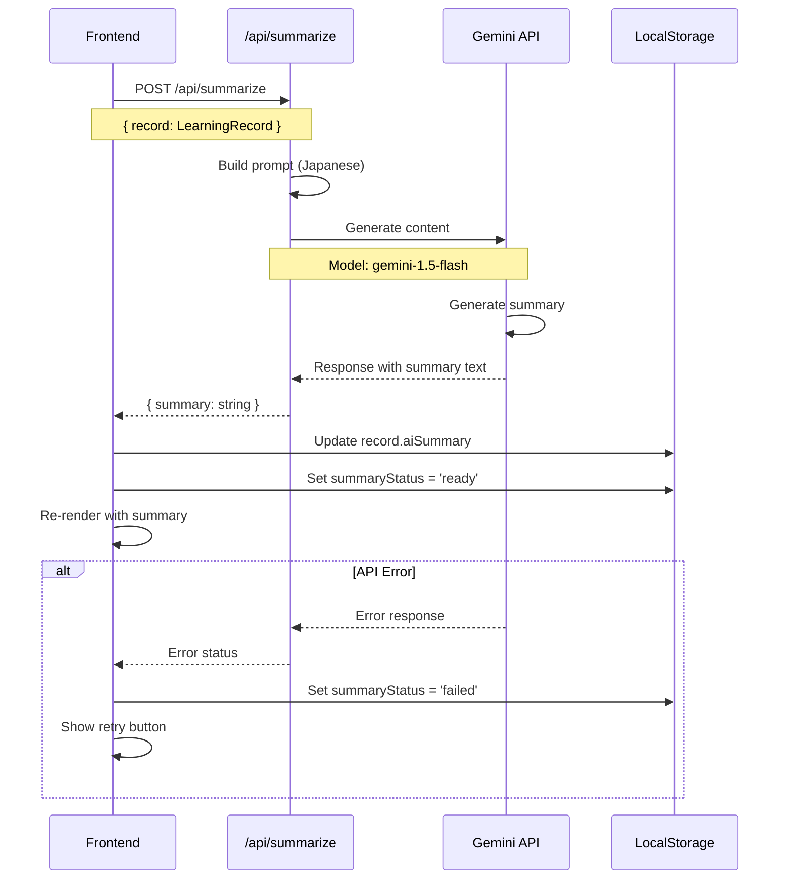

---

## コンポーネント構成

### Reactコンポーネント階層

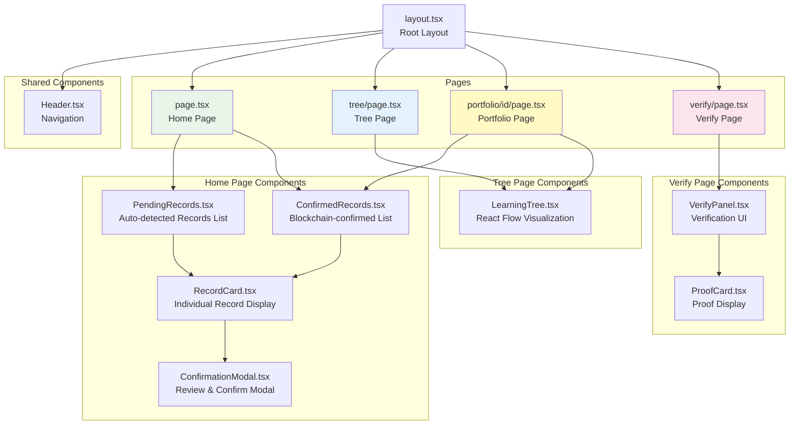

### 状態管理フロー

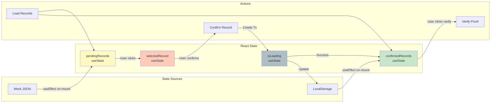

---

## ディレクトリ構造

### プロジェクト全体構造図

```mermaid
graph TB
    Root[symproof-tree/]

    Root --> Src[src/]
    Root --> Public[public/]
    Root --> Docs[docs/]
    Root --> Config[Config Files]

    Src --> App[app/]
    Src --> Components[components/]
    Src --> Lib[lib/]
    Src --> Types[types/]
    Src --> Constants[constants/]

    App --> HomePage[page.tsx]
    App --> TreePage[tree/page.tsx]
    App --> PortfolioPage[portfolio/id/page.tsx]
    App --> VerifyPage[verify/page.tsx]
    App --> LayoutPage[layout.tsx]
    App --> APIRoute[api/summarize/route.ts]

    Components --> C1[PendingRecords.tsx]
    Components --> C2[ConfirmedRecords.tsx]
    Components --> C3[ConfirmationModal.tsx]
    Components --> C4[LearningTree.tsx]
    Components --> C5[RecordCard.tsx]
    Components --> C6[ProofCard.tsx]
    Components --> C7[VerifyPanel.tsx]
    Components --> C8[Header.tsx]

    Lib --> Detection[detection/]
    Lib --> Symbol[symbol/]
    Lib --> AI[ai/]
    Lib --> Storage[storage/]
    Lib --> Utils[utils/]

    Detection --> D1[auto-tracker.ts]
    Detection --> D2[score-calculator.ts]
    Detection --> D3[tag-extractor.ts]

    Symbol --> S1[client.ts]
    Symbol --> S2[transaction.ts]
    Symbol --> S3[verify.ts]
    Symbol --> S4[types.ts]

    AI --> A1[summarize.ts]

    Storage --> St1[local.ts]

    Utils --> U1[hash.ts]
    Utils --> U2[validation.ts]

    Types --> T1[index.ts]

    Constants --> Const1[index.ts]

    Public --> Mock1[mock-browsing-sessions.json]
    Public --> Mock2[mock-confirmed-records.json]

    Docs --> Doc1[SPEC.md]
    Docs --> Doc2[ARCHITECTURE.md]
    Docs --> Doc3[SETUP.md]
    Docs --> Doc4[DEMO_GUIDE.md]
    Docs --> Doc5[DATA_MODELS.md]

    Config --> Conf1[package.json]
    Config --> Conf2[tsconfig.json]
    Config --> Conf3[tailwind.config.ts]
    Config --> Conf4[next.config.js]
    Config --> Conf5[.env.local]
    Config --> Conf6[.env.example]

    style Src fill:#E3F2FD
    style Lib fill:#FFF9C4
    style Components fill:#C8E6C9
    style Public fill:#FFCCBC
    style Docs fill:#F3E5F5
```

### ファイル責務マトリクス

| ディレクトリ | ファイル | 責務 |
|------------|---------|------|
| `src/app/` | `page.tsx` | ホームページ: Pending/Confirmed records表示 |
| | `tree/page.tsx` | 学習ツリー可視化ページ |
| | `portfolio/[id]/page.tsx` | ポートフォリオ共有ページ |
| | `verify/page.tsx` | ブロックチェーン検証ページ |
| | `layout.tsx` | ルートレイアウト・ナビゲーション |
| | `api/summarize/route.ts` | Gemini API統合 |
| `src/components/` | `PendingRecords.tsx` | 自動検出された保留中記録のリスト |
| | `ConfirmedRecords.tsx` | ブロックチェーン確認済み記録のリスト |
| | `ConfirmationModal.tsx` | 記録確認・承認モーダル |
| | `LearningTree.tsx` | React Flowツリー可視化 |
| | `RecordCard.tsx` | 個別記録カード（読み取り専用） |
| | `ProofCard.tsx` | ブロックチェーン証明表示 |
| | `VerifyPanel.tsx` | 検証UIパネル |
| | `Header.tsx` | ナビゲーションヘッダー |
| `src/lib/detection/` | `auto-tracker.ts` | BrowsingSession → LearningRecord変換 |
| | `score-calculator.ts` | 理解度スコア計算ロジック |
| | `tag-extractor.ts` | URLからタグ抽出 |
| `src/lib/symbol/` | `client.ts` | Symbol SDK初期化 |
| | `transaction.ts` | トランザクション作成・送信 |
| | `verify.ts` | ブロックチェーン検証ロジック |
| | `types.ts` | Symbol固有の型定義 |
| `src/lib/ai/` | `summarize.ts` | Gemini API呼び出しロジック |
| `src/lib/storage/` | `local.ts` | LocalStorage操作 |
| `src/lib/utils/` | `hash.ts` | SHA-256ハッシュ計算 |
| | `validation.ts` | データ検証 |
| `src/types/` | `index.ts` | グローバル型定義 |
| `src/constants/` | `index.ts` | アプリケーション定数 |
| `public/` | `mock-browsing-sessions.json` | デモ用ブラウジングセッションデータ |
| | `mock-confirmed-records.json` | デモ用確認済み記録データ |

---

## 技術スタック

### フロントエンド技術

```mermaid
graph TB
    subgraph "Frontend Stack"
        Next[Next.js 14<br/>App Router]
        React[React 18<br/>UI Library]
        TS[TypeScript<br/>Strict Mode]
        Tailwind[Tailwind CSS<br/>Styling]
        ReactFlow[React Flow<br/>Tree Visualization]
    end

    subgraph "State Management"
        Hooks[React Hooks<br/>useState, useEffect, useContext]
        LocalStorage[LocalStorage API<br/>Browser Storage]
    end

    subgraph "Blockchain Integration"
        SymbolSDK[symbol-sdk v3<br/>Transaction & Account]
        SymbolNode[Symbol Testnet Node<br/>sym-test-03.opening-line.jp:3001]
    end

    subgraph "AI Integration"
        GeminiSDK[@google/generative-ai<br/>Gemini API Client]
        GeminiModel[gemini-1.5-flash<br/>Summarization Model]
    end

    subgraph "Build Tools"
        Node[Node.js]
        NPM[npm<br/>Package Manager]
        PostCSS[PostCSS<br/>Autoprefixer]
    end

    Next --> React
    Next --> TS
    React --> Hooks
    React --> Tailwind
    React --> ReactFlow
    Hooks --> LocalStorage
    Next --> SymbolSDK
    SymbolSDK --> SymbolNode
    Next --> GeminiSDK
    GeminiSDK --> GeminiModel
    Next --> PostCSS

    style Next fill:#000000,color:#FFFFFF
    style SymbolSDK fill:#44D62C
    style GeminiSDK fill:#FF6B6B
    style ReactFlow fill:#FF69B4
```

### 依存パッケージ

| パッケージ | バージョン | 用途 |
|-----------|----------|------|
| `next` | 14.x | Reactフレームワーク |
| `react` | 18.x | UIライブラリ |
| `typescript` | 5.x | 型安全性 |
| `tailwindcss` | 3.x | スタイリング |
| `symbol-sdk` | 3.x | Symbol blockchain統合 |
| `@google/generative-ai` | latest | Gemini API統合 |
| `reactflow` | latest | グラフ可視化 |
| `uuid` | 9.x | UUID生成 |
| `@types/uuid` | 9.x | UUID型定義 |

---

## データモデル関連図

### エンティティ関係図

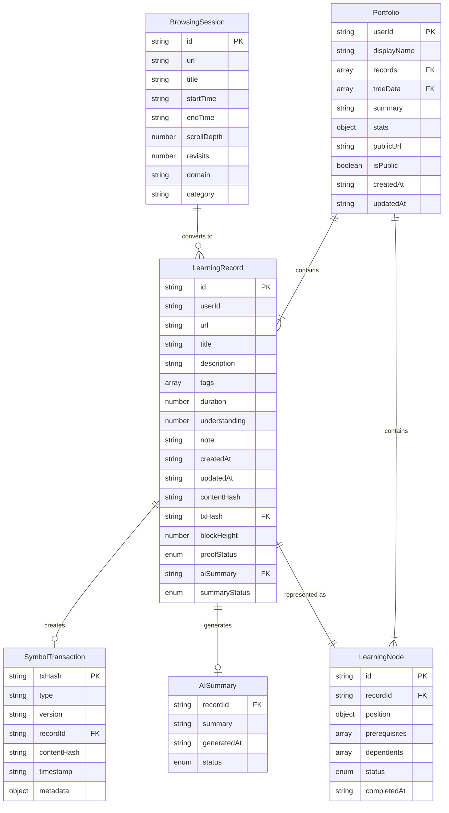

### 状態遷移図

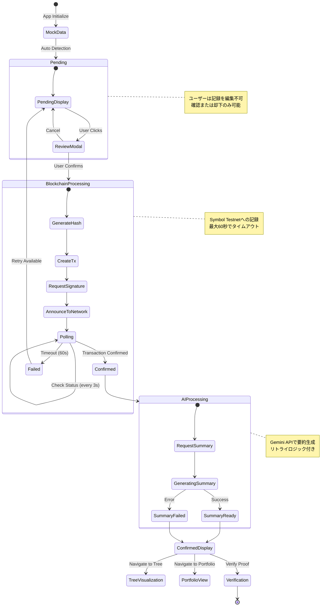

### データ変換フロー

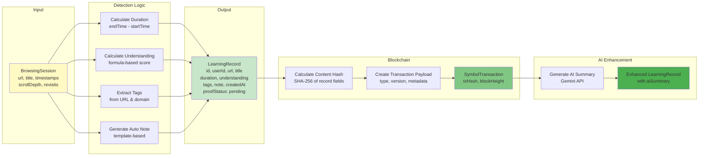

---

## セキュリティ考慮事項

### データ整合性保証

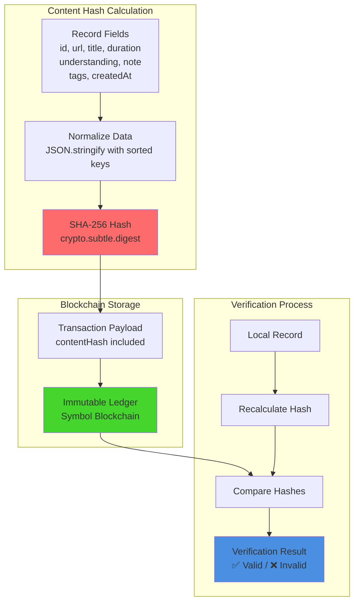

### 改ざん防止メカニズム

1. **自動記録**: ユーザーがデータを編集不可（システムが生成）
2. **コンテンツハッシュ**: 記録内容のSHA-256ハッシュを計算
3. **ブロックチェーン記録**: ハッシュをSymbol Testnetに記録
4. **検証可能性**: 第三者が任意に真正性を検証可能

---

## パフォーマンス考慮事項

### データ読み込み戦略

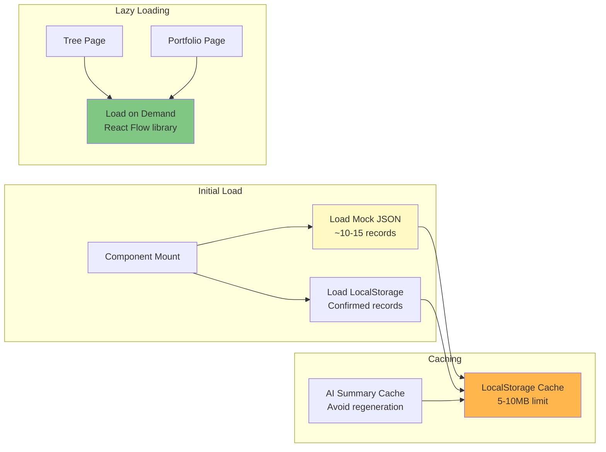

### トランザクション最適化

- **ポーリング戦略**: 3秒間隔、最大60秒
- **バッチ処理**: 将来的に複数記録を一度に確認可能
- **リトライロジック**: AI要約生成は最大3回リトライ（指数バックオフ）

---

## デプロイメント構成

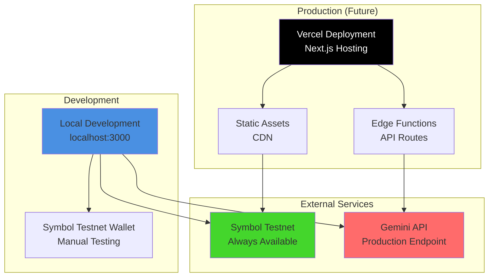

---

## 今後の拡張性

### Phase 2: Browser Extension

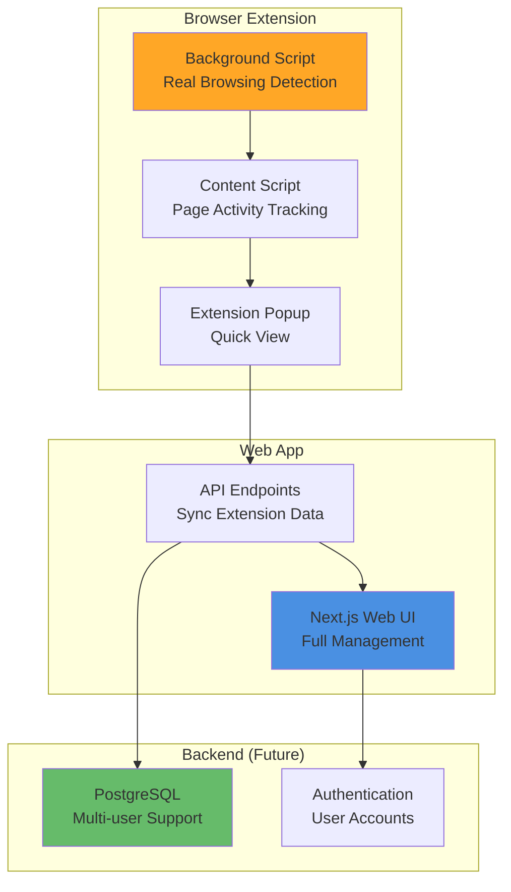

---

## まとめ

本アーキテクチャは以下の原則に基づいて設計されています：

1. **自動性**: ユーザー入力を最小化し、システムが客観的にデータを生成
2. **透明性**: すべてのデータフローが可視化され、検証可能
3. **改ざん耐性**: ブロックチェーンによる暗号学的保証
4. **拡張性**: モジュール設計により、将来的な機能追加が容易
5. **シンプルさ**: デモスコープに最適化し、不要な複雑性を排除

この設計により、2-3週間でのMVP実装が可能であり、インターンシップのデモンストレーションに十分な価値を提供できます。
