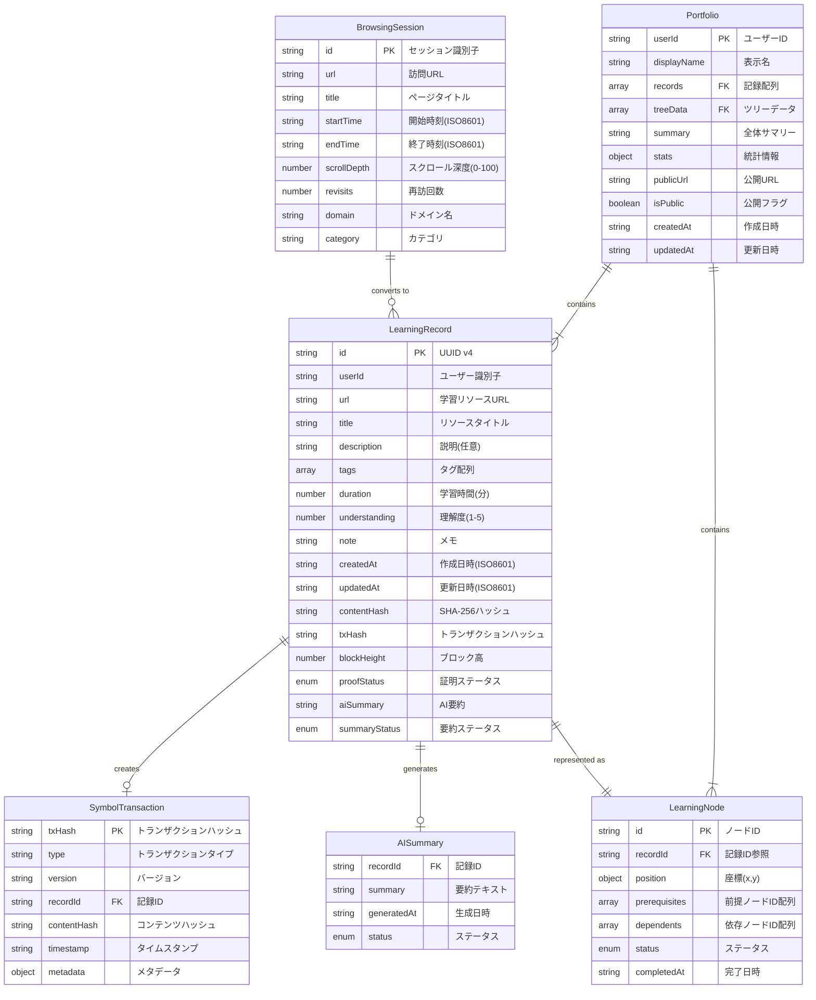

# symproof-tree データモデル仕様書

## 目次
1. [データモデル概要](#データモデル概要)
2. [BrowsingSession（入力データ）](#browsingsession入力データ)
3. [LearningRecord（コアエンティティ）](#learningrecordコアエンティティ)
4. [LearningNode（ツリー可視化）](#learningnodeツリー可視化)
5. [Portfolio（ユーザープロファイル）](#portfolioユーザープロファイル)
6. [SymbolTransaction（ブロックチェーン）](#symboltransactionブロックチェーン)
7. [データ変換ロジック](#データ変換ロジック)
8. [バリデーションルール](#バリデーションルール)
9. [ストレージ仕様](#ストレージ仕様)

---

## データモデル概要

### エンティティ関係図



---

## BrowsingSession（入力データ）

### 概要

モックブラウジングデータの基本単位。将来的にはブラウザ拡張機能から取得される。

### TypeScript定義

```typescript
interface BrowsingSession {
  id: string;                           // セッション識別子 (例: "session-001")
  url: string;                          // 訪問URL (例: "https://nextjs.org/docs/...")
  title: string;                        // ページタイトル
  startTime: string;                    // 開始時刻 (ISO8601形式)
  endTime: string;                      // 終了時刻 (ISO8601形式)
  scrollDepth: number;                  // スクロール深度 (0-100の整数)
  revisits: number;                     // 再訪回数 (0以上の整数)
  domain: string;                       // ドメイン名 (例: "nextjs.org")
  category: string;                     // カテゴリ (例: "web-development")
}
```

### フィールド詳細

| フィールド | 型 | 必須 | 説明 | 例 |
|-----------|-----|------|------|-----|
| `id` | string | ✅ | セッション一意識別子 | "session-001" |
| `url` | string | ✅ | 訪問したURL（HTTPS推奨） | "https://nextjs.org/docs/app/building-your-application/routing" |
| `title` | string | ✅ | ページのタイトルタグ内容 | "Routing: Defining Routes \| Next.js" |
| `startTime` | string | ✅ | セッション開始時刻（ISO8601） | "2024-11-01T14:30:00Z" |
| `endTime` | string | ✅ | セッション終了時刻（ISO8601） | "2024-11-01T15:15:00Z" |
| `scrollDepth` | number | ✅ | ページをスクロールした割合（0-100） | 85 |
| `revisits` | number | ✅ | 同じURLへの再訪回数 | 2 |
| `domain` | string | ✅ | URLのドメイン部分 | "nextjs.org" |
| `category` | string | ✅ | 学習カテゴリ | "web-development" |

### バリデーションルール

```typescript
const validateBrowsingSession = (session: BrowsingSession): boolean => {
  // IDが存在する
  if (!session.id || session.id.trim() === '') return false;

  // URLが有効
  try {
    new URL(session.url);
  } catch {
    return false;
  }

  // タイトルが存在する
  if (!session.title || session.title.trim() === '') return false;

  // 時刻がISO8601形式
  if (isNaN(Date.parse(session.startTime))) return false;
  if (isNaN(Date.parse(session.endTime))) return false;

  // endTime > startTime
  if (new Date(session.endTime) <= new Date(session.startTime)) return false;

  // scrollDepthが0-100の範囲
  if (session.scrollDepth < 0 || session.scrollDepth > 100) return false;

  // revisitsが0以上
  if (session.revisits < 0) return false;

  // domainが存在する
  if (!session.domain || session.domain.trim() === '') return false;

  // categoryが存在する
  if (!session.category || session.category.trim() === '') return false;

  return true;
};
```

### サンプルデータ

```json
{
  "id": "session-001",
  "url": "https://nextjs.org/docs/app/building-your-application/routing",
  "title": "Routing: Defining Routes | Next.js",
  "startTime": "2024-11-01T14:30:00Z",
  "endTime": "2024-11-01T15:15:00Z",
  "scrollDepth": 85,
  "revisits": 2,
  "domain": "nextjs.org",
  "category": "web-development"
}
```

---

## LearningRecord（コアエンティティ）

### 概要

学習記録の中心的なデータモデル。BrowsingSessionから変換され、ブロックチェーンに記録される。

### TypeScript定義

```typescript
interface LearningRecord {
  // Identity
  id: string;                           // UUID v4
  userId: string;                       // Symbol addressまたはセッションID

  // Content
  url: string;                          // 学習リソースURL
  title: string;                        // リソースタイトル
  description?: string;                 // オプション説明
  tags: string[];                       // カテゴリ/トピック配列

  // Metrics
  duration: number;                     // 学習時間（分）
  understanding: 1 | 2 | 3 | 4 | 5;     // 理解度スコア
  note: string;                         // 自動生成メモ

  // Timestamps
  createdAt: string;                    // 作成日時 (ISO8601)
  updatedAt?: string;                   // 更新日時 (ISO8601)

  // Blockchain Proof
  contentHash: string;                  // SHA-256ハッシュ
  txHash?: string;                      // Symbolトランザクションハッシュ
  blockHeight?: number;                 // ブロック番号
  proofStatus: 'pending' | 'confirmed' | 'failed'; // トランザクションステータス

  // AI Generated
  aiSummary?: string;                   // Gemini生成要約
  summaryStatus: 'none' | 'generating' | 'ready' | 'failed'; // 要約ステータス
}
```

### フィールド詳細

#### Identity（識別情報）

| フィールド | 型 | 必須 | 説明 | 例 |
|-----------|-----|------|------|-----|
| `id` | string | ✅ | UUID v4形式の一意識別子 | "a1b2c3d4-e5f6-7890-abcd-ef1234567890" |
| `userId` | string | ✅ | ユーザー識別子（Symbol address） | "TABC123...XYZ" または "demo-user" |

#### Content（コンテンツ）

| フィールド | 型 | 必須 | 説明 | 例 |
|-----------|-----|------|------|-----|
| `url` | string | ✅ | 学習リソースのURL | "https://nextjs.org/docs/..." |
| `title` | string | ✅ | リソースタイトル | "Routing: Defining Routes" |
| `description` | string | ⚪ | 追加説明（任意） | "Next.jsのルーティング基礎" |
| `tags` | string[] | ✅ | カテゴリタグ配列 | ["Next.js", "React", "ルーティング"] |

#### Metrics（メトリクス）

| フィールド | 型 | 必須 | 説明 | 例 |
|-----------|-----|------|------|-----|
| `duration` | number | ✅ | 学習時間（分単位） | 45 |
| `understanding` | 1\|2\|3\|4\|5 | ✅ | 理解度スコア（1=低、5=高） | 4 |
| `note` | string | ✅ | 自動生成メモ | "自動記録されたセッション (スクロール深度: 85%, 再訪回数: 2回)" |

#### Timestamps（タイムスタンプ）

| フィールド | 型 | 必須 | 説明 | 例 |
|-----------|-----|------|------|-----|
| `createdAt` | string | ✅ | 作成日時（ISO8601） | "2024-11-01T15:15:00Z" |
| `updatedAt` | string | ⚪ | 更新日時（ISO8601） | "2024-11-01T15:20:00Z" |

#### Blockchain Proof（ブロックチェーン証明）

| フィールド | 型 | 必須 | 説明 | 例 |
|-----------|-----|------|------|-----|
| `contentHash` | string | ✅ | 記録内容のSHA-256ハッシュ | "a1b2c3d4e5f6..." (64文字) |
| `txHash` | string | ⚪ | Symbolトランザクションハッシュ | "E7A4B9C2D1F3..." (64文字) |
| `blockHeight` | number | ⚪ | ブロック番号 | 1234567 |
| `proofStatus` | enum | ✅ | 証明ステータス | "pending" / "confirmed" / "failed" |

#### AI Generated（AI生成）

| フィールド | 型 | 必須 | 説明 | 例 |
|-----------|-----|------|------|-----|
| `aiSummary` | string | ⚪ | Gemini生成の日本語要約 | "Next.jsのApp Routerについて学習..." |
| `summaryStatus` | enum | ✅ | 要約生成ステータス | "none" / "generating" / "ready" / "failed" |

### バリデーションルール

```typescript
const validateLearningRecord = (record: LearningRecord): boolean => {
  // IDがUUID v4形式
  const uuidRegex = /^[0-9a-f]{8}-[0-9a-f]{4}-4[0-9a-f]{3}-[89ab][0-9a-f]{3}-[0-9a-f]{12}$/i;
  if (!uuidRegex.test(record.id)) return false;

  // userIdが存在
  if (!record.userId || record.userId.trim() === '') return false;

  // URLが有効
  try {
    new URL(record.url);
  } catch {
    return false;
  }

  // タイトルが存在
  if (!record.title || record.title.trim() === '') return false;

  // tagsが配列で要素数1以上
  if (!Array.isArray(record.tags) || record.tags.length === 0) return false;

  // durationが正の数
  if (record.duration <= 0) return false;

  // understandingが1-5の範囲
  if (![1, 2, 3, 4, 5].includes(record.understanding)) return false;

  // noteが存在
  if (!record.note || record.note.trim() === '') return false;

  // createdAtがISO8601形式
  if (isNaN(Date.parse(record.createdAt))) return false;

  // contentHashが64文字（SHA-256）
  if (!/^[a-f0-9]{64}$/i.test(record.contentHash)) return false;

  // proofStatusが有効な値
  if (!['pending', 'confirmed', 'failed'].includes(record.proofStatus)) return false;

  // summaryStatusが有効な値
  if (!['none', 'generating', 'ready', 'failed'].includes(record.summaryStatus)) return false;

  // txHashがある場合は64文字
  if (record.txHash && !/^[A-F0-9]{64}$/i.test(record.txHash)) return false;

  // blockHeightがある場合は正の整数
  if (record.blockHeight && record.blockHeight <= 0) return false;

  return true;
};
```

### サンプルデータ

#### Pending状態

```json
{
  "id": "a1b2c3d4-e5f6-7890-abcd-ef1234567890",
  "userId": "demo-user",
  "url": "https://nextjs.org/docs/app/building-your-application/routing",
  "title": "Routing: Defining Routes | Next.js",
  "description": "",
  "tags": ["Next.js", "web-development", "ルーティング"],
  "duration": 45,
  "understanding": 4,
  "note": "自動記録されたセッション (スクロール深度: 85%, 再訪回数: 2回)",
  "createdAt": "2024-11-01T15:15:00Z",
  "contentHash": "a1b2c3d4e5f6a7b8c9d0e1f2a3b4c5d6e7f8a9b0c1d2e3f4a5b6c7d8e9f0a1b2",
  "proofStatus": "pending",
  "summaryStatus": "none"
}
```

#### Confirmed状態

```json
{
  "id": "a1b2c3d4-e5f6-7890-abcd-ef1234567890",
  "userId": "demo-user",
  "url": "https://nextjs.org/docs/app/building-your-application/routing",
  "title": "Routing: Defining Routes | Next.js",
  "description": "",
  "tags": ["Next.js", "web-development", "ルーティング"],
  "duration": 45,
  "understanding": 4,
  "note": "自動記録されたセッション (スクロール深度: 85%, 再訪回数: 2回)",
  "createdAt": "2024-11-01T15:15:00Z",
  "updatedAt": "2024-11-01T15:16:30Z",
  "contentHash": "a1b2c3d4e5f6a7b8c9d0e1f2a3b4c5d6e7f8a9b0c1d2e3f4a5b6c7d8e9f0a1b2",
  "txHash": "E7A4B9C2D1F3A5B7C9D2E4F6A8B0C2D4E6F8A0B2C4D6E8F0A2B4C6D8E0F2A4B6",
  "blockHeight": 1234567,
  "proofStatus": "confirmed",
  "aiSummary": "Next.jsのApp Routerについて45分間学習。サーバーコンポーネントとクライアントコンポーネントの使い分けを理解し、ルーティングの基本概念を習得。",
  "summaryStatus": "ready"
}
```

---

## LearningNode（ツリー可視化）

### 概要

React Flowで学習ツリーを表示するためのノードデータ。

### TypeScript定義

```typescript
interface LearningNode {
  id: string;                           // ノード一意識別子
  recordId: string;                     // LearningRecordへの参照

  // Position (React Flow)
  position: {
    x: number;                          // X座標
    y: number;                          // Y座標
  };

  // Relationships
  prerequisites: string[];              // 前提ノードID配列
  dependents: string[];                 // 依存ノードID配列

  // Status
  status: 'completed' | 'in-progress' | 'locked'; // ノードステータス
  completedAt?: string;                 // 完了日時 (ISO8601)
}
```

### フィールド詳細

| フィールド | 型 | 必須 | 説明 | 例 |
|-----------|-----|------|------|-----|
| `id` | string | ✅ | ノード識別子（LearningRecord.idと同じ） | "node-001" |
| `recordId` | string | ✅ | 対応するLearningRecordのID | "a1b2c3d4-..." |
| `position.x` | number | ✅ | X座標（ピクセル） | 250 |
| `position.y` | number | ✅ | Y座標（ピクセル） | 100 |
| `prerequisites` | string[] | ✅ | 前提となるノードIDの配列 | ["node-002", "node-003"] |
| `dependents` | string[] | ✅ | このノードに依存するノードIDの配列 | ["node-004"] |
| `status` | enum | ✅ | ノードの状態 | "completed" / "in-progress" / "locked" |
| `completedAt` | string | ⚪ | 完了日時（ISO8601） | "2024-11-01T15:15:00Z" |

### ステータス定義

| ステータス | 説明 | 表示色 |
|----------|------|--------|
| `completed` | 学習完了、ブロックチェーン記録済み | 緑 |
| `in-progress` | 現在学習中、または保留中 | 黄 |
| `locked` | 前提学習が未完了のため未着手 | グレー |

### サンプルデータ

```json
{
  "id": "node-001",
  "recordId": "a1b2c3d4-e5f6-7890-abcd-ef1234567890",
  "position": {
    "x": 250,
    "y": 100
  },
  "prerequisites": ["node-002"],
  "dependents": ["node-003", "node-004"],
  "status": "completed",
  "completedAt": "2024-11-01T15:15:00Z"
}
```

### React Flow変換

```typescript
import { Node, Edge } from 'reactflow';

const convertToReactFlowNode = (learningNode: LearningNode, record: LearningRecord): Node => {
  return {
    id: learningNode.id,
    type: 'custom',
    position: learningNode.position,
    data: {
      label: record.title,
      understanding: record.understanding,
      duration: record.duration,
      status: learningNode.status,
      proofStatus: record.proofStatus,
      aiSummary: record.aiSummary
    }
  };
};

const convertToReactFlowEdges = (nodes: LearningNode[]): Edge[] => {
  const edges: Edge[] = [];

  nodes.forEach(node => {
    node.prerequisites.forEach(prereqId => {
      edges.push({
        id: `${prereqId}-${node.id}`,
        source: prereqId,
        target: node.id,
        type: 'smoothstep',
        animated: node.status === 'in-progress'
      });
    });
  });

  return edges;
};
```

---

## Portfolio（ユーザープロファイル）

### 概要

ユーザーの学習履歴全体をまとめたポートフォリオデータ。

### TypeScript定義

```typescript
interface Portfolio {
  userId: string;                       // Symbol address
  displayName?: string;                 // オプション表示名

  // Content
  records: LearningRecord[];            // 全学習記録
  treeData: LearningNode[];             // ツリーノードデータ

  // Metadata
  summary: string;                      // AI生成の全体サマリー
  stats: {
    totalRecords: number;               // 総記録数
    totalDuration: number;              // 総学習時間（分）
    averageUnderstanding: number;       // 平均理解度
    topTags: string[];                  // 頻出タグTOP5
  };

  // Sharing
  publicUrl: string;                    // 公開URL
  isPublic: boolean;                    // 公開フラグ

  // Timestamps
  createdAt: string;                    // 作成日時
  updatedAt: string;                    // 更新日時
}
```

### フィールド詳細

| フィールド | 型 | 必須 | 説明 | 例 |
|-----------|-----|------|------|-----|
| `userId` | string | ✅ | ユーザー識別子 | "TABC123...XYZ" |
| `displayName` | string | ⚪ | 表示名 | "山田太郎" |
| `records` | LearningRecord[] | ✅ | 全学習記録配列 | [...] |
| `treeData` | LearningNode[] | ✅ | ツリーノード配列 | [...] |
| `summary` | string | ✅ | AI生成の全体要約 | "Next.js、Symbol、TypeScriptを..." |
| `stats.totalRecords` | number | ✅ | 総記録数 | 15 |
| `stats.totalDuration` | number | ✅ | 総学習時間（分） | 675 |
| `stats.averageUnderstanding` | number | ✅ | 平均理解度 | 4.2 |
| `stats.topTags` | string[] | ✅ | 頻出タグ配列 | ["Next.js", "React", ...] |
| `publicUrl` | string | ✅ | 公開URL | "http://localhost:3000/portfolio/TABC..." |
| `isPublic` | boolean | ✅ | 公開フラグ | true |
| `createdAt` | string | ✅ | 作成日時 | "2024-10-25T10:00:00Z" |
| `updatedAt` | string | ✅ | 更新日時 | "2024-11-01T15:20:00Z" |

### 統計情報計算ロジック

```typescript
const calculatePortfolioStats = (records: LearningRecord[]): Portfolio['stats'] => {
  const totalRecords = records.length;

  const totalDuration = records.reduce((sum, r) => sum + r.duration, 0);

  const totalUnderstanding = records.reduce((sum, r) => sum + r.understanding, 0);
  const averageUnderstanding = totalRecords > 0
    ? Math.round((totalUnderstanding / totalRecords) * 10) / 10
    : 0;

  // タグ頻度計算
  const tagFrequency: Record<string, number> = {};
  records.forEach(record => {
    record.tags.forEach(tag => {
      tagFrequency[tag] = (tagFrequency[tag] || 0) + 1;
    });
  });

  // 頻度順にソート、TOP5取得
  const topTags = Object.entries(tagFrequency)
    .sort((a, b) => b[1] - a[1])
    .slice(0, 5)
    .map(([tag]) => tag);

  return {
    totalRecords,
    totalDuration,
    averageUnderstanding,
    topTags
  };
};
```

### サンプルデータ

```json
{
  "userId": "TABC1234567890XYZABC1234567890XYZABC1234",
  "displayName": "山田太郎",
  "records": [
    { "id": "record-001", ... },
    { "id": "record-002", ... }
  ],
  "treeData": [
    { "id": "node-001", ... },
    { "id": "node-002", ... }
  ],
  "summary": "Next.js、Symbol Blockchain、TypeScriptを中心に学習。Web開発の基礎から実践的なブロックチェーン統合まで幅広く習得。",
  "stats": {
    "totalRecords": 15,
    "totalDuration": 675,
    "averageUnderstanding": 4.2,
    "topTags": ["Next.js", "React", "Symbol", "TypeScript", "Blockchain"]
  },
  "publicUrl": "http://localhost:3000/portfolio/TABC1234567890XYZABC1234567890XYZABC1234",
  "isPublic": true,
  "createdAt": "2024-10-25T10:00:00Z",
  "updatedAt": "2024-11-01T15:20:00Z"
}
```

---

## SymbolTransaction（ブロックチェーン）

### 概要

Symbol blockchainに記録されるトランザクションペイロード。

### TypeScript定義

```typescript
interface SymbolTransactionPayload {
  type: 'learning_record';              // トランザクションタイプ（固定）
  version: '1.0';                       // ペイロードバージョン
  id: string;                           // LearningRecord ID
  contentHash: string;                  // SHA-256ハッシュ
  timestamp: string;                    // タイムスタンプ (ISO8601)
  metadata: {
    title: string;                      // タイトル
    duration: number;                   // 学習時間
    understanding: number;              // 理解度
    tags: string[];                     // タグ配列
  };
}
```

### フィールド詳細

| フィールド | 型 | 必須 | 説明 | 例 |
|-----------|-----|------|------|-----|
| `type` | string | ✅ | トランザクションタイプ（固定値） | "learning_record" |
| `version` | string | ✅ | ペイロードバージョン | "1.0" |
| `id` | string | ✅ | LearningRecordの参照ID | "a1b2c3d4-..." |
| `contentHash` | string | ✅ | SHA-256コンテンツハッシュ | "a1b2c3d4e5..." |
| `timestamp` | string | ✅ | 記録時刻（ISO8601） | "2024-11-01T15:15:00Z" |
| `metadata.title` | string | ✅ | 記録タイトル | "Routing: Defining Routes" |
| `metadata.duration` | number | ✅ | 学習時間（分） | 45 |
| `metadata.understanding` | number | ✅ | 理解度スコア | 4 |
| `metadata.tags` | string[] | ✅ | タグ配列 | ["Next.js", "React"] |

### Symbol SDK実装

```typescript
import {
  Account,
  Address,
  Deadline,
  PlainMessage,
  TransferTransaction,
  NetworkType,
  UInt64,
  RepositoryFactoryHttp
} from 'symbol-sdk';

const createLearningProof = async (
  record: LearningRecord,
  senderAccount: Account,
  nodeUrl: string,
  epochAdjustment: number
): Promise<TransferTransaction> => {
  // ペイロード作成
  const payload: SymbolTransactionPayload = {
    type: 'learning_record',
    version: '1.0',
    id: record.id,
    contentHash: record.contentHash,
    timestamp: record.createdAt,
    metadata: {
      title: record.title,
      duration: record.duration,
      understanding: record.understanding,
      tags: record.tags
    }
  };

  // JSON文字列化
  const payloadJson = JSON.stringify(payload);

  // PlainMessage作成
  const message = PlainMessage.create(payloadJson);

  // TransferTransaction作成（自己宛）
  const transferTx = TransferTransaction.create(
    Deadline.create(epochAdjustment),
    Address.createFromRawAddress(senderAccount.address.plain()),
    [],  // モザイク転送なし
    message,
    NetworkType.TEST_NET,
    UInt64.fromUint(2000000)  // 最大手数料 (0.002 XYM)
  );

  return transferTx;
};
```

### トランザクション署名と送信

```typescript
const signAndAnnounce = async (
  transaction: TransferTransaction,
  account: Account,
  nodeUrl: string
): Promise<string> => {
  const repositoryFactory = new RepositoryFactoryHttp(nodeUrl);
  const transactionHttp = repositoryFactory.createTransactionRepository();

  // 署名
  const signedTx = account.sign(transaction, networkGenerationHash);

  // アナウンス
  await transactionHttp.announce(signedTx).toPromise();

  // トランザクションハッシュを返す
  return signedTx.hash;
};
```

### サンプルペイロード（JSON）

```json
{
  "type": "learning_record",
  "version": "1.0",
  "id": "a1b2c3d4-e5f6-7890-abcd-ef1234567890",
  "contentHash": "a1b2c3d4e5f6a7b8c9d0e1f2a3b4c5d6e7f8a9b0c1d2e3f4a5b6c7d8e9f0a1b2",
  "timestamp": "2024-11-01T15:15:00Z",
  "metadata": {
    "title": "Routing: Defining Routes | Next.js",
    "duration": 45,
    "understanding": 4,
    "tags": ["Next.js", "web-development", "ルーティング"]
  }
}
```

---

## データ変換ロジック

### BrowsingSession → LearningRecord

```typescript
import { v4 as uuidv4 } from 'uuid';

const convertSessionToRecord = (session: BrowsingSession): LearningRecord => {
  // 学習時間計算（分）
  const duration = calculateDuration(session.startTime, session.endTime);

  // 理解度スコア計算
  const understanding = calculateUnderstanding(
    duration,
    session.scrollDepth,
    session.revisits
  );

  // タグ抽出
  const tags = extractTags(session.url, session.category);

  // 自動メモ生成
  const note = generateAutoNote(session);

  // コンテンツハッシュは後で計算
  const contentHash = '';

  return {
    id: uuidv4(),
    userId: 'demo-user',  // 実際はSymbol addressを使用
    url: session.url,
    title: session.title,
    description: '',
    tags,
    duration,
    understanding,
    note,
    createdAt: session.endTime,
    contentHash,
    proofStatus: 'pending',
    summaryStatus: 'none'
  };
};
```

### 学習時間計算

```typescript
const calculateDuration = (startTime: string, endTime: string): number => {
  const start = new Date(startTime).getTime();
  const end = new Date(endTime).getTime();
  const durationMs = end - start;

  // ミリ秒を分に変換（四捨五入）
  return Math.round(durationMs / 60000);
};
```

### 理解度スコア計算

```typescript
const calculateUnderstanding = (
  duration: number,
  scrollDepth: number,
  revisits: number
): 1 | 2 | 3 | 4 | 5 => {
  // 基本スコア: 30分ごとに1点
  let score = Math.floor(duration / 30);

  // スクロール深度ボーナス: 33%ごとに1点
  score += Math.floor(scrollDepth / 33);

  // 再訪ボーナス: 各再訪で1点
  score += revisits;

  // 1-5の範囲に制限
  return Math.min(5, Math.max(1, score)) as 1 | 2 | 3 | 4 | 5;
};
```

### タグ抽出

```typescript
const extractTags = (url: string, category: string): string[] => {
  const tags: string[] = [category];

  try {
    const urlObj = new URL(url);
    const domain = urlObj.hostname;
    const path = urlObj.pathname.toLowerCase();

    // ドメインベースのタグ
    if (domain.includes('nextjs')) tags.push('Next.js');
    if (domain.includes('symbol')) tags.push('Symbol', 'Blockchain');
    if (domain.includes('typescript')) tags.push('TypeScript');
    if (domain.includes('react')) tags.push('React');

    // パスベースのタグ
    if (path.includes('routing')) tags.push('ルーティング');
    if (path.includes('transaction')) tags.push('トランザクション');
    if (path.includes('types')) tags.push('型システム');
    if (path.includes('api')) tags.push('API');
    if (path.includes('component')) tags.push('コンポーネント');

    // 重複削除
    return [...new Set(tags)];
  } catch (error) {
    return [category];
  }
};
```

### 自動メモ生成

```typescript
const generateAutoNote = (session: BrowsingSession): string => {
  return `自動記録されたセッション (スクロール深度: ${session.scrollDepth}%, 再訪回数: ${session.revisits}回)`;
};
```

### コンテンツハッシュ計算

```typescript
const calculateContentHash = async (record: LearningRecord): Promise<string> => {
  // ハッシュ対象フィールドを選択
  const content = {
    id: record.id,
    url: record.url,
    title: record.title,
    duration: record.duration,
    understanding: record.understanding,
    note: record.note,
    tags: record.tags,
    createdAt: record.createdAt
  };

  // キーをソートしてJSON化
  const sortedKeys = Object.keys(content).sort();
  const sortedContent: Record<string, any> = {};
  sortedKeys.forEach(key => {
    sortedContent[key] = (content as any)[key];
  });

  const jsonString = JSON.stringify(sortedContent);

  // SHA-256ハッシュ計算
  const encoder = new TextEncoder();
  const data = encoder.encode(jsonString);
  const hashBuffer = await crypto.subtle.digest('SHA-256', data);

  // ArrayBufferを16進数文字列に変換
  const hashArray = Array.from(new Uint8Array(hashBuffer));
  const hashHex = hashArray.map(b => b.toString(16).padStart(2, '0')).join('');

  return hashHex;
};
```

---

## バリデーションルール

### 共通ルール

```typescript
// URL形式チェック
const isValidUrl = (url: string): boolean => {
  try {
    new URL(url);
    return true;
  } catch {
    return false;
  }
};

// ISO8601形式チェック
const isValidIso8601 = (timestamp: string): boolean => {
  return !isNaN(Date.parse(timestamp));
};

// UUID v4形式チェック
const isValidUuidV4 = (id: string): boolean => {
  const regex = /^[0-9a-f]{8}-[0-9a-f]{4}-4[0-9a-f]{3}-[89ab][0-9a-f]{3}-[0-9a-f]{12}$/i;
  return regex.test(id);
};

// SHA-256ハッシュ形式チェック
const isValidSha256 = (hash: string): boolean => {
  return /^[a-f0-9]{64}$/i.test(hash);
};
```

---

## ストレージ仕様

### LocalStorage構造

```typescript
interface LocalStorageSchema {
  // 保留中記録
  'symproof-tree:pending-records': LearningRecord[];

  // 確認済み記録
  'symproof-tree:confirmed-records': LearningRecord[];

  // ツリーデータ
  'symproof-tree:tree-nodes': LearningNode[];

  // ユーザー設定
  'symproof-tree:user-settings': {
    userId: string;
    displayName?: string;
    lastSync: string;
  };

  // ポートフォリオキャッシュ
  'symproof-tree:portfolio-cache': Portfolio;
}
```

### CRUD操作

```typescript
// 保留中記録を保存
const savePendingRecords = (records: LearningRecord[]): void => {
  localStorage.setItem(
    'symproof-tree:pending-records',
    JSON.stringify(records)
  );
};

// 保留中記録を取得
const getPendingRecords = (): LearningRecord[] => {
  const json = localStorage.getItem('symproof-tree:pending-records');
  return json ? JSON.parse(json) : [];
};

// 記録を確認済みに移動
const confirmRecord = (recordId: string): void => {
  const pending = getPendingRecords();
  const confirmed = getConfirmedRecords();

  const recordIndex = pending.findIndex(r => r.id === recordId);
  if (recordIndex === -1) return;

  const record = pending[recordIndex];
  pending.splice(recordIndex, 1);
  confirmed.push(record);

  savePendingRecords(pending);
  saveConfirmedRecords(confirmed);
};

// 確認済み記録を保存
const saveConfirmedRecords = (records: LearningRecord[]): void => {
  localStorage.setItem(
    'symproof-tree:confirmed-records',
    JSON.stringify(records)
  );
};

// 確認済み記録を取得
const getConfirmedRecords = (): LearningRecord[] => {
  const json = localStorage.getItem('symproof-tree:confirmed-records');
  return json ? JSON.parse(json) : [];
};

// 記録を更新（txHash, blockHeight, aiSummary等）
const updateRecord = (recordId: string, updates: Partial<LearningRecord>): void => {
  const confirmed = getConfirmedRecords();
  const index = confirmed.findIndex(r => r.id === recordId);

  if (index !== -1) {
    confirmed[index] = { ...confirmed[index], ...updates };
    saveConfirmedRecords(confirmed);
  }
};
```

---

## まとめ

このデータモデル仕様書では、symproof-treeアプリケーションで使用されるすべてのデータ構造、変換ロジック、バリデーションルールを定義しました。

### 重要ポイント

1. **BrowsingSession**: モックデータの入力形式
2. **LearningRecord**: アプリケーションのコアエンティティ
3. **SymbolTransaction**: ブロックチェーンに記録されるペイロード
4. **自動変換**: ユーザー入力なしでBrowsingSessionからLearningRecordを生成
5. **コンテンツハッシュ**: SHA-256で改ざん検知
6. **LocalStorage**: ブラウザベースの永続化

この仕様に従うことで、一貫性のあるデータ管理が実現できます。
