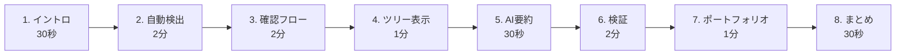

# symproof-tree デモ実施ガイド

## 目次
1. [デモ概要](#デモ概要)
2. [事前準備チェックリスト](#事前準備チェックリスト)
3. [デモシナリオ（詳細版）](#デモシナリオ詳細版)
4. [画面操作手順](#画面操作手順)
5. [トラブルシューティング](#トラブルシューティング)
6. [デモ用トークスクリプト](#デモ用トークスクリプト)
7. [よくある質問](#よくある質問)

---

## デモ概要

### 目的

Symbolブロックチェーンを活用した学習証跡管理システムのプロトタイプを、インターンシップ応募のポートフォリオとして紹介する。

### 想定時間

**8〜10分** (質疑応答を含めて15分程度)

### デモの流れ



### キーメッセージ

1. **自動性**: ユーザーが入力する必要がない
2. **客観性**: システムが記録するので改ざん不可
3. **透明性**: すべての記録がブロックチェーンで検証可能
4. **実用性**: 就職活動で使える信頼性の高いポートフォリオ

---

## 事前準備チェックリスト

### 技術的準備（デモ前日までに完了）

- [ ] アプリケーションが正常に起動する（`npm run dev`）
- [ ] Symbol Desktop Walletがインストール済み
- [ ] Testnetモードで設定済み
- [ ] Wallet残高が50 XYM以上ある
- [ ] Google AI API Keyが設定済み
- [ ] `.env.local`が正しく設定されている
- [ ] ブラウザ拡張機能が正常に動作する
- [ ] インターネット接続が安定している

### データ準備

- [ ] `public/mock-browsing-sessions.json`に10-15件のリアルなデータ
- [ ] `public/mock-confirmed-records.json`に2-3件の事前確認済み記録
- [ ] Pending Recordsに少なくとも3-5件の記録が表示される
- [ ] 1件はデモ中に実際にブロックチェーンに記録予定

### デモ環境

- [ ] プロジェクター/画面共有の動作確認
- [ ] ブラウザのズームレベルを適切に設定（125%推奨）
- [ ] 開発者ツールを閉じる（画面を広く使う）
- [ ] 不要なブラウザタブを閉じる
- [ ] 通知をオフにする

### バックアップ準備

- [ ] デモ動画を録画しておく（ライブデモ失敗時のバックアップ）
- [ ] スクリーンショットを複数枚用意
- [ ] Symbol Explorerでトランザクションを事前に確認

---

## デモシナリオ（詳細版）

### 1. イントロダクション（30秒）

**目的**: プロジェクトの価値提案を明確にする

**トークポイント**:
- 「今回のデモでは、Symbolブロックチェーンを活用した学習証跡管理システムを紹介します」
- 「このシステムの特徴は、Web上での学習活動を**自動的に検出**し、**改ざん不可能**な証跡として記録することです」
- 「就職活動において、自分の学習履歴を客観的に証明できるポートフォリオとして活用できます」

**画面操作**:
- ブラウザで`http://localhost:3000`を開く
- ホームページを表示

---

### 2. 自動検出デモ（2分）

**目的**: システムが自動的に学習記録を生成することを示す

#### 操作手順

1. **Pending Recordsタブを表示**
   - ホームページの「Pending」タブをクリック（デフォルトで表示されている場合はそのまま）

2. **記録リストを説明**
   - 3-5件の自動検出された記録が表示されている
   - 各記録カードには以下が表示されている：
     - タイトル（例: "Routing: Defining Routes | Next.js"）
     - URL（例: "https://nextjs.org/docs/app/building-your-application/routing"）
     - 学習時間（例: "45分"）
     - 理解度スコア（例: "4/5"）
     - タグ（例: "Next.js", "web-development", "ルーティング"）
     - 自動生成メモ（例: "自動記録されたセッション (スクロール深度: 85%, 再訪回数: 2回)"）

3. **自動生成フィールドを強調**

**トークポイント**:
- 「システムが自動的にブラウザでの学習活動を検出しました」
- 「例えば、この記録では『Next.jsのドキュメントを45分間閲覧した』ことが記録されています」
- 「理解度スコアは、**滞在時間、スクロール深度、再訪回数**から自動的に推定されます」
- 「タグはURLから自動抽出されるため、手動で入力する必要はありません」
- 「**重要なポイント**: ユーザーはこれらの値を編集できません。システムが客観的に記録します」

#### デモポイント

- カードをホバーして、すべてのフィールドが表示されることを確認
- 複数の記録をスクロールして見せる
- 異なる学習内容（Next.js、Symbol、TypeScript）が記録されていることを示す

---

### 3. 記録確認フロー（2分）

**目的**: ユーザーが記録を確認し、ブロックチェーンに記録するプロセスを示す

#### 操作手順

1. **記録カードをクリック**
   - Pending Recordsから任意の記録（例: "Routing: Defining Routes | Next.js"）をクリック

2. **確認モーダルが表示される**
   - モーダルに以下が表示される：
     - 完全な記録詳細（読み取り専用）
     - コンテンツハッシュ（SHA-256）
     - 警告メッセージ: 「記録後は変更できません」
     - アクションボタン: 「ブロックチェーンに記録する」

3. **読み取り専用であることを強調**

**トークポイント**:
- 「ユーザーは記録の詳細を確認できますが、**編集はできません**」
- 「すべてのフィールドが読み取り専用になっており、客観性が保たれます」
- 「この内容のハッシュ値（SHA-256）が表示されています。このハッシュがブロックチェーンに記録されます」
- 「警告メッセージが表示されており、一度記録すると変更できないことがユーザーに通知されます」

4. **ブロックチェーンに記録する**
   - 「ブロックチェーンに記録する」ボタンをクリック

5. **Symbol Wallet署名画面**
   - Symbol Desktop Walletの署名プロンプトが表示される
   - トランザクション詳細が表示される：
     - 受信者アドレス（自己宛）
     - メッセージペイロード（JSON形式）
     - 手数料（約0.02 XYM）

**トークポイント**:
- 「Symbol Walletが起動し、署名を求められます」
- 「ユーザーは記録の実行を承認するだけです。データは変更できません」
- 「トランザクション手数料は非常に低く、約0.02 XYMです」

6. **署名を承認**
   - Walletで「Confirm」または「承認」ボタンをクリック

7. **トランザクション送信中**
   - ローディングインジケーターが表示される
   - 「トランザクションをブロックチェーンに送信中...」というメッセージ

**トークポイント**:
- 「トランザクションがSymbol Testnetに送信されました」
- 「約30秒でブロックに含まれ、確認されます」

8. **確認完了**
   - 約30秒後、記録がPendingタブからConfirmedタブに移動
   - Confirmed Recordsタブに切り替え

9. **確認済み記録を表示**
   - 記録カードにブロックチェーン証明が表示される：
     - トランザクションハッシュ
     - ブロック高
     - 確認時刻
     - ブロックチェーンアイコン（✅）

**トークポイント**:
- 「記録がブロックチェーンで確認されました」
- 「トランザクションハッシュとブロック高が表示されており、第三者が検証できます」
- 「この記録は今や改ざん不可能です」

---

### 4. Learning Tree可視化（1分）

**目的**: 学習の進捗を視覚的に表示

#### 操作手順

1. **Treeページに移動**
   - ナビゲーションメニューから「Tree」をクリック
   - またはURL: `http://localhost:3000/tree`

2. **Learning Treeを表示**
   - React Flowによる学習ノードグラフが表示される
   - 各ノードは学習記録を表す
   - エッジは前提関係を表す

3. **ノードの説明**

**トークポイント**:
- 「学習の進捗が木構造で可視化されます」
- 「緑色のノードは完了した学習、グレーのノードはまだ学習していない内容です」
- 「矢印は前提関係を表しており、例えば『JavaScript』を学んでから『TypeScript』を学ぶ、といった関係がわかります」

4. **インタラクション**
   - ノードをクリックして詳細を表示
   - ズームイン/アウト
   - ドラッグで画面を移動

**トークポイント**:
- 「ノードをクリックすると詳細が表示されます」
- 「この可視化により、自分の学習の全体像を把握できます」

---

### 5. AI要約生成（30秒）

**目的**: Gemini APIによる自動要約を示す

#### 操作手順

1. **Confirmed Recordsに戻る**
   - ナビゲーションから「Home」をクリック
   - Confirmed Recordsタブを選択

2. **AI要約を確認**
   - 先ほどブロックチェーンに記録した記録カードに、AI生成された要約が表示されている
   - 日本語で2-3文の簡潔な要約

**トークポイント**:
- 「記録確定後、AIが自動的に学習内容を要約します」
- 「例えば、『Next.jsのApp Routerについて45分間学習。サーバーコンポーネントとクライアントコンポーネントの使い分けを理解。』のように、人間が読みやすい形で要約されます」
- 「この要約はGoogle Gemini API（gemini-1.5-flashモデル）によって生成されています」

---

### 6. 検証デモ（2分）

**目的**: 第三者がブロックチェーン上で記録の真正性を検証できることを示す

#### 操作手順

1. **Verifyページに移動**
   - ナビゲーションから「Verify」をクリック
   - またはURL: `http://localhost:3000/verify`

2. **トランザクションハッシュをコピー**
   - Confirmed Recordsページに戻る（別タブで開く）
   - 任意の記録カードからトランザクションハッシュをコピー
   - 例: `E7A4B9C2D1F3A5B7C9D2E4F6A8B0C2D4E6F8A0B2C4D6E8F0A2B4C6D8E0F2A4B6`

3. **ハッシュを入力**
   - Verifyページの入力フィールドにペースト
   - 「Verify」ボタンをクリック

4. **検証プロセス**
   - ローディング表示
   - Symbol Testnetからトランザクションを取得
   - ローカル記録と比較
   - ハッシュを再計算して一致確認

5. **検証結果を表示**
   - ✅ **Transaction Exists**: トランザクションがブロックチェーンに存在
   - ✅ **Content Hash Matches**: コンテンツハッシュが一致（改ざんなし）
   - ✅ **Timestamp Verified**: タイムスタンプが一致
   - ℹ️ **Transaction Details**:
     - Block Height: 1234567
     - Timestamp: 2024-11-01T15:15:00Z
     - Title: Routing: Defining Routes | Next.js

**トークポイント**:
- 「第三者が任意の記録の真正性を検証できます」
- 「トランザクションハッシュを入力するだけで、ブロックチェーン上のデータと比較します」
- 「すべての検証項目が緑色のチェックマークになっており、記録が改ざんされていないことが証明されました」
- 「もし誰かがローカルデータを改ざんしようとしても、ハッシュが一致しないため即座に検出されます」

6. **Symbol Explorerで外部確認**
   - 検証結果画面の「View on Symbol Explorer」リンクをクリック
   - 新しいタブでSymbol Explorerが開く
   - ブロックチェーン上の実際のトランザクションデータが表示される

**トークポイント**:
- 「公式のSymbol Explorerでも確認できます」
- 「ここに表示されているのが、ブロックチェーンに記録された実際のデータです」
- 「誰でもこのURLにアクセスして、記録の存在を確認できます」

---

### 7. ポートフォリオ共有（1分）

**目的**: 学習履歴をポートフォリオとして共有できることを示す

#### 操作手順

1. **Portfolioページに移動**
   - ナビゲーションから「Portfolio」をクリック
   - またはURL: `http://localhost:3000/portfolio/[your-symbol-address]`

2. **ポートフォリオ内容を表示**
   - **ヘッダー**:
     - ユーザー識別子（Symbol address略記）
     - 統計情報: 総記録数、総学習時間、平均理解度

   - **AI生成サマリー**:
     - 全体的な学習ナラティブ
     - 主要トピック

   - **学習記録リスト**:
     - すべてのConfirmed Recordsがカード形式で表示
     - 各カードにブロックチェーン証明バッジ
     - AI要約の抜粋

   - **Learning Tree埋め込み**:
     - インタラクティブなツリー表示（読み取り専用）

**トークポイント**:
- 「このページは就職活動で共有できるポートフォリオです」
- 「統計情報が一目でわかります。例えば『総学習時間225分、記録数5件、平均理解度4.2』などです」
- 「すべての記録にブロックチェーン証明が付いており、企業の採用担当者が真正性を即座に検証できます」
- 「このURLを履歴書やLinkedInに掲載することで、客観的な学習履歴を示せます」

3. **URL共有の説明**

**トークポイント**:
- 「このURLは公開可能で、誰でもアクセスできます」
- 「従来の手書きポートフォリオと違い、すべてのデータがブロックチェーンで裏付けられています」

---

### 8. まとめ（30秒）

**目的**: デモの要点を再確認し、今後の展望を述べる

**トークポイント**:
- 「それでは、このシステムの特徴をまとめます」
- **自動検出**: 「ユーザーが入力する必要がなく、システムが客観的に記録します」
- **改ざん耐性**: 「Symbolブロックチェーンにより、記録の改ざんが不可能です」
- **透明性**: 「第三者が任意に真正性を検証でき、信頼性が高いです」
- **実用性**: 「就職活動で使える、客観的なポートフォリオとして活用できます」

**今後の展望**:
- 「将来的には、実際のブラウザ拡張機能として実装し、リアルタイムで学習を記録できるようにしたいと考えています」
- 「また、企業向けの検証APIを提供し、採用プロセスに統合することも可能です」
- 「Symbolブロックチェーンの高速性と低コストを活かし、大規模な学習記録管理にも対応できます」

**締めの言葉**:
- 「以上が、symproof-treeのデモとなります」
- 「ご質問があれば、お答えします」

---

## 画面操作手順（クイックリファレンス）

### ホームページ

```
http://localhost:3000
```

**操作**:
1. Pendingタブ → 自動検出された記録を表示
2. 記録カードをクリック → 確認モーダル表示
3. 「ブロックチェーンに記録する」→ Wallet署名 → 送信
4. Confirmedタブ → ブロックチェーン確認済み記録を表示

### Treeページ

```
http://localhost:3000/tree
```

**操作**:
1. ノードをクリック → 詳細表示
2. マウスホイール → ズーム
3. ドラッグ → 画面移動

### Verifyページ

```
http://localhost:3000/verify
```

**操作**:
1. トランザクションハッシュを入力
2. 「Verify」ボタンをクリック
3. 検証結果を確認
4. 「View on Symbol Explorer」→ 外部確認

### Portfolioページ

```
http://localhost:3000/portfolio/[symbol-address]
```

**操作**:
1. 統計情報を表示
2. 記録リストをスクロール
3. ツリーを表示

---

## トラブルシューティング

### デモ中によくある問題

#### 1. トランザクションが確認されない

**症状**: 30秒経っても記録がConfirmedに移動しない

**対処法**:
- 「Symbol Testnetが混雑している可能性があります。通常30秒ですが、最大60秒お待ちください」
- それでも確認されない場合: 「時間の都合上、事前に確認済みの記録を使ってデモを続けます」
- Confirmed Recordsタブで既存の記録を使用

#### 2. Wallet署名画面が表示されない

**症状**: 「ブロックチェーンに記録する」をクリックしても何も起こらない

**対処法**:
- Symbol Desktop Walletが起動しているか確認
- Walletウィンドウが背面に隠れている可能性 → タスクバーから前面に
- それでも表示されない場合: 「技術的な問題が発生しました。事前に記録した例をお見せします」

#### 3. AI要約が生成されない

**症状**: Confirmed Recordに要約が表示されない

**対処法**:
- 「AI要約は10-20秒かかります。先に検証機能をお見せします」
- Verifyページに移動してデモを続ける
- 後でホームに戻って確認

#### 4. Symbol Explorerが開かない

**症状**: リンクをクリックしても何も起こらない

**対処法**:
- URLを手動でコピー: `https://testnet.symbol.fyi/transactions/[txHash]`
- ブラウザの新しいタブに貼り付け

#### 5. ページが真っ白になる

**症状**: React エラーで画面が白くなる

**対処法**:
- F5でページをリロード
- それでも直らない場合: 開発サーバーを再起動（Ctrl+C → `npm run dev`）
- 時間がない場合: 録画したデモ動画を使用

---

## デモ用トークスクリプト（完全版）

### イントロ（30秒）

> 「本日は、私が開発したSymbolブロックチェーンを活用した学習証跡管理システム『symproof-tree』をご紹介します。
>
> このシステムの最大の特徴は、Web上での学習活動を**自動的に検出**し、**改ざん不可能**な証跡として記録することです。
>
> 従来のポートフォリオは手動で作成するため、主観的で信頼性に欠ける場合がありました。しかし、このシステムではブロックチェーン技術により、客観的で検証可能な学習履歴を提供できます。
>
> それでは、実際の動作をお見せします。」

### 自動検出（2分）

> 「まず、システムが自動的に学習記録を検出する機能をお見せします。
>
> （Pendingタブを表示）
>
> ご覧いただいているのは、システムが自動的に検出した学習記録のリストです。
>
> 例えば、この記録では『Next.jsのドキュメントを45分間閲覧した』ことが記録されています。
>
> （記録カードをホバー）
>
> 各記録には以下の情報が含まれています：
> - URL: 学習したリソースのURL
> - タイトル: ページタイトル
> - 学習時間: 滞在時間から自動計算
> - 理解度スコア: スクロール深度と再訪回数から推定
> - タグ: URLから自動抽出
>
> （別の記録を指す）
>
> こちらはSymbolブロックチェーンのドキュメントを120分学習した記録です。理解度は5点満点中5点と推定されています。
>
> **重要なポイント**は、ユーザーはこれらの値を**一切編集できない**ということです。
>
> すべてシステムが客観的に記録するため、後から『実は5時間勉強した』などと改ざんすることができません。
>
> これにより、真に客観的な学習記録が実現できます。」

### 確認フロー（2分）

> 「それでは、実際にこの記録をブロックチェーンに記録してみます。
>
> （記録カードをクリック）
>
> ユーザーは記録の詳細を確認できますが、編集はできません。すべてのフィールドが読み取り専用になっています。
>
> （コンテンツハッシュを指す）
>
> ここに表示されているのが、この記録のSHA-256ハッシュ値です。このハッシュがブロックチェーンに記録されます。
>
> （警告メッセージを指す）
>
> 『記録後は変更できません』という警告も表示されており、ユーザーに不可逆性を通知しています。
>
> （「ブロックチェーンに記録する」ボタンをクリック）
>
> それでは、ブロックチェーンに記録します。
>
> （Wallet署名画面が表示される）
>
> Symbol Walletが起動し、署名を求められます。
>
> ここで重要なのは、ユーザーは**記録の実行を承認するだけ**で、データ自体は変更できないということです。
>
> トランザクション手数料は約0.02 XYMと非常に低コストです。
>
> （署名を承認）
>
> 署名を承認すると、トランザクションがSymbol Testnetに送信されます。
>
> （ローディング表示）
>
> Symbolブロックチェーンのブロック生成時間は約30秒です。少々お待ちください。
>
> （確認完了）
>
> トランザクションが確認されました！
>
> （Confirmed Recordsタブに移動）
>
> 記録がPendingからConfirmedに移動しました。
>
> （ブロックチェーン情報を指す）
>
> トランザクションハッシュ、ブロック高、確認時刻が表示されています。
>
> この記録は今や、改ざん不可能です。」

### Tree可視化（1分）

> 「次に、学習の進捗を可視化する機能をお見せします。
>
> （Treeページに移動）
>
> 学習記録が木構造で表示されます。
>
> 緑色のノードは完了した学習、グレーのノードはまだ学習していない内容を表しています。
>
> （ノードをクリック）
>
> ノードをクリックすると、詳細情報が表示されます。
>
> （エッジを指す）
>
> 矢印は前提関係を表しており、例えば『JavaScriptを学んでからTypeScriptを学ぶ』といった学習の流れがわかります。
>
> この可視化により、自分の学習の全体像を把握し、次に何を学ぶべきかが明確になります。」

### AI要約（30秒）

> 「さらに、AIによる自動要約機能もあります。
>
> （Confirmed Recordsに戻る）
>
> 先ほどブロックチェーンに記録した学習記録に、AI生成された要約が表示されています。
>
> （要約を読む）
>
> 『Next.jsのApp Routerについて45分間学習。サーバーコンポーネントとクライアントコンポーネントの使い分けを理解。』
>
> このように、人間が読みやすい形で要約されます。
>
> この要約はGoogle Gemini API（gemini-1.5-flashモデル）によって生成されており、高品質な日本語要約が得られます。」

### 検証（2分）

> 「それでは、第三者がこの記録の真正性を検証できることを実演します。
>
> （Verifyページに移動）
>
> 検証ページでは、トランザクションハッシュを入力するだけで、ブロックチェーン上のデータと比較できます。
>
> （トランザクションハッシュをコピー&ペースト）
>
> （「Verify」ボタンをクリック）
>
> システムが以下を検証します：
> 1. トランザクションがブロックチェーンに存在するか
> 2. コンテンツハッシュが一致するか
> 3. タイムスタンプが一致するか
>
> （検証結果を表示）
>
> すべての検証項目が緑色のチェックマークになりました。
>
> これは、記録が改ざんされていないことを証明しています。
>
> もし誰かがローカルデータを改ざんしようとしても、ハッシュが一致しないため即座に検出されます。
>
> （「View on Symbol Explorer」リンクをクリック）
>
> 公式のSymbol Explorerでも確認できます。
>
> （Symbol Explorer画面）
>
> これがブロックチェーン上の実際のトランザクションデータです。
>
> 誰でもこのURLにアクセスして、記録の存在を確認できます。
>
> 企業の採用担当者も、このリンクから簡単に真正性を検証できます。」

### ポートフォリオ（1分）

> 「最後に、学習履歴をポートフォリオとして共有する機能をお見せします。
>
> （Portfolioページに移動）
>
> このページは就職活動で共有できるポートフォリオです。
>
> （統計情報を指す）
>
> 総学習時間225分、記録数5件、平均理解度4.2といった統計情報が一目でわかります。
>
> （記録リストをスクロール）
>
> すべての記録にブロックチェーン証明バッジが付いており、信頼性が保証されています。
>
> （Learning Treeを指す）
>
> 学習ツリーも埋め込まれており、学習の全体像を視覚的に示せます。
>
> このURLを履歴書やLinkedInに掲載することで、客観的で検証可能な学習履歴を企業にアピールできます。
>
> 従来の手書きポートフォリオと違い、すべてのデータがブロックチェーンで裏付けられているため、信頼性が格段に高いです。」

### まとめ（30秒）

> 「それでは、このシステムの特徴をまとめます。
>
> **1. 自動性**: ユーザーが入力する必要がなく、システムが客観的に記録します。
>
> **2. 改ざん耐性**: Symbolブロックチェーンにより、記録の改ざんが不可能です。
>
> **3. 透明性**: 第三者が任意に真正性を検証でき、信頼性が高いです。
>
> **4. 実用性**: 就職活動で使える、客観的なポートフォリオとして活用できます。
>
> 将来的には、実際のブラウザ拡張機能として実装し、リアルタイムで学習を記録できるようにしたいと考えています。
>
> また、企業向けの検証APIを提供し、採用プロセスに統合することも可能です。
>
> Symbolブロックチェーンの高速性と低コストを活かし、大規模な学習記録管理にも対応できます。
>
> 以上が、symproof-treeのデモとなります。
>
> ご質問があれば、お答えします。ありがとうございました。」

---

## よくある質問

### 技術的な質問

**Q1: なぜSymbolブロックチェーンを選んだのですか?**

A: 以下の理由からSymbolを選択しました：
- **高速**: ブロック生成時間が約30秒と高速
- **低コスト**: トランザクション手数料が非常に低い（約0.02 XYM）
- **使いやすいSDK**: TypeScript SDKが充実しており、Next.jsとの統合が容易
- **メッセージ機能**: TransferTransactionのメッセージフィールドでJSONデータを送信可能
- **日本のコミュニティ**: 日本語のドキュメントとコミュニティが充実

**Q2: なぜユーザーが編集できないようにしたのですか?**

A: 客観性を保つためです。ユーザーが自由に編集できると、実際よりも長い学習時間を記録したり、理解度を水増ししたりする可能性があります。自動記録により、システムが客観的にデータを生成するため、第三者（企業の採用担当者など）が信頼できる情報源となります。

**Q3: ブラウザ拡張はいつ実装しますか?**

A: 現在のMVPはデモ用にモックデータを使用していますが、Phase 2として実際のブラウザ拡張機能の実装を計画しています。Chrome Extension APIを使用し、リアルタイムで学習活動を検出する予定です。

**Q4: プライバシーは大丈夫ですか?**

A: 以下の対策を考えています：
- **ユーザー制御**: ユーザーが記録を承認するまでブロックチェーンに送信されない
- **Dismiss機能**: 記録したくない学習活動は却下可能
- **最小限のデータ**: URLとタイトルのみを記録し、ページ内容は記録しない
- **オプトイン**: ブラウザ拡張はユーザーが有効化した場合のみ動作

**Q5: 他のブロックチェーンでも動作しますか?**

A: アーキテクチャ上は可能ですが、現在はSymbolに最適化されています。Ethereum、Polygon、Solanaなどへの対応も技術的には可能ですが、トランザクション手数料やブロック生成時間を考慮すると、Symbolが最適だと判断しています。

### ビジネス的な質問

**Q6: どのようなビジネスモデルを考えていますか?**

A: 以下のモデルを検討中です：
- **B2C**: 個人ユーザー向けフリーミアムモデル（基本無料、高度な機能は有料）
- **B2B**: 企業向け検証API（採用プロセスに統合）
- **教育機関**: 学校や大学での学習記録管理システムとしての提供

**Q7: 競合はいますか?**

A: 類似サービスとして以下がありますが、差別化要因があります：
- **LinkedIn Learning**: 学習記録はあるが、ブロックチェーンによる証明がない
- **Udemy/Coursera**: コース修了証明書はあるが、日常的な学習活動は記録されない
- **手書きポートフォリオ**: 主観的で検証が困難

**差別化要因**:
- **自動記録**: 手動入力不要
- **ブロックチェーン証明**: 改ざん不可能
- **包括的**: あらゆる学習活動を記録（特定のプラットフォームに限定されない）

**Q8: スケーラビリティは?**

A: 以下の戦略で対応します：
- **オフチェーン**: 詳細データはLocalStorage/データベースに保存
- **オンチェーン**: ハッシュとメタデータのみをブロックチェーンに記録
- **バッチ処理**: 複数の記録をAggregate Transactionで一度に送信
- **Symbol の高スループット**: 1秒あたり数百トランザクション処理可能

### デモ関連の質問

**Q9: デモ中にトランザクションが失敗したらどうしますか?**

A: 以下のバックアップを用意しています：
- 事前に記録した複数のConfirmed Records
- デモ動画の録画
- スクリーンショット
- Symbol Explorerの事前確認済みトランザクションリンク

**Q10: どれくらいの開発期間でしたか?**

A: 約2-3週間でMVPを開発しました。内訳：
- Phase 1（セットアップ）: 2日
- Phase 2（コア機能）: 5日
- Phase 3（可視化・AI）: 5日
- Phase 4（検証・ポリッシュ）: 3日

---

## デモ後のフォローアップ

### 提供すべき資料

1. **GitHub リポジトリURL** (公開している場合)
2. **デモ動画** (録画しておく)
3. **スクリーンショット集**
4. **Symbol Explorer トランザクションリンク**
5. **技術資料** (ARCHITECTURE.md, SPEC.md)

### 連絡先情報

デモ後に質問を受け付けるため、以下を準備：
- Email
- GitHub
- LinkedIn
- Twitter/X

---

## チェックリスト（デモ直前）

### 10分前

- [ ] PCの充電を確認
- [ ] インターネット接続を確認
- [ ] Symbol Desktop Walletを起動
- [ ] 開発サーバーを起動（`npm run dev`）
- [ ] ブラウザで http://localhost:3000 を開く
- [ ] Pending Recordsに3-5件表示されているか確認
- [ ] Wallet残高が50 XYM以上あるか確認

### 5分前

- [ ] 通知をオフ
- [ ] 不要なアプリケーションを終了
- [ ] ブラウザの不要なタブを閉じる
- [ ] プロジェクター/画面共有をテスト
- [ ] 音声をミュート（不要な通知音を防ぐ）

### デモ開始時

- [ ] 深呼吸
- [ ] 自己紹介
- [ ] デモ開始

---

**デモの成功を祈ります！ 🎉**

自信を持って、システムの価値を伝えてください。技術的な問題が発生しても、落ち着いてバックアッププランを使用すれば大丈夫です。

頑張ってください！
